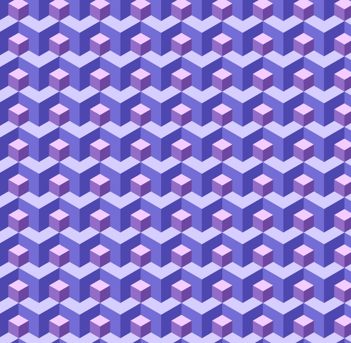
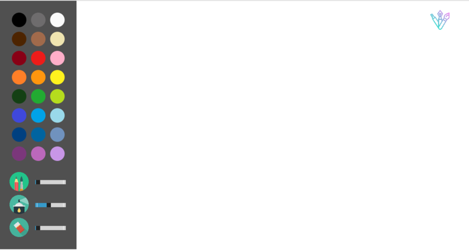

# Programming basics
This repository is for **Basic Javascript** lecture related materials and assignments.  
I've not uploaded lecture materials due to copyright issues.  

---
## Summary
### Assignments

</img> 
</img>
</img>

### Final term project: Drawing board

</img>
</img>
 Works pretty well! 

---
## Library
Javascript based on p5js  
For more information visit: [p5js](https://p5js.org/) 
